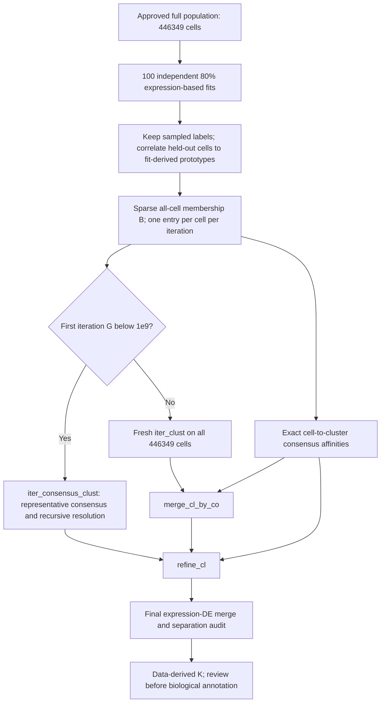

# Allen consensus technical notes — before benchmarking

Start with the [short algorithm audit](HICAT_ALLEN_CONSENSUS_ALGORITHM_AUDIT.md).
This companion records the detailed trace, fidelity limits and asset contract.

**Status: source audit complete; implementation qualification and full-data benchmark pending.**
No consensus fit, benchmark job, or 100-iteration production job was launched by
this audit. The population is the **approved Step 02: 446,349 cells × 19,071
genes, from 12 dissected E14.5 mouse MGE samples**. The 12,000-cell pilot and
its 38/17-cluster comparisons remain diagnostic assets.

**Finding:** Allen's scalable consensus assigns held-out cells before
aggregation. Use that procedure; the earlier conditional co-sampling denominator
is superseded. There is also an explicit large-graph branch which bypasses
`iter_consensus_clust`. Neither a fixed pilot hierarchy nor a target K is needed.

## Exact reference versions

- Consensus reference: Allen `scrattch.hicat`, commit
  [`9af2f04cb837a7b53b005dee88a92eae337afead`](https://github.com/AllenInstitute/scrattch.hicat/tree/9af2f04cb837a7b53b005dee88a92eae337afead).
- Historical sparse collector: commit
  [`91d0934e7eec31794b5945a5570ad92d7a3a9521`](https://github.com/AllenInstitute/scrattch.hicat/tree/91d0934e7eec31794b5945a5570ad92d7a3a9521),
  dated 2018-06-29, contemporaneous with the checked-in tutorial.
- Existing Python fitter: Allen `transcriptomic_clustering`, commit
  [`99154957c74023235763025fda9dc4eb3ca952c6`](https://github.com/AllenInstitute/transcriptomic_clustering/tree/99154957c74023235763025fda9dc4eb3ca952c6).

Pinned source files, licenses, line references, and checksums are saved in
[`references/allen_consensus_audit_20260908/`](references/allen_consensus_audit_20260908/).
References below are to the pinned files, not a moving branch.

## Function trace and scale assessment

“Unchanged” describes the source operation and its allocation pattern, not a
claim that an R function is callable from the existing Python pipeline.

| Order / exact function | What it actually does | Assessment at 446,349 cells |
| --- | --- | --- |
| 1. `run_consensus_clust`, `consensusCluster.R:489–536` | Samples `round(N × .8)` cells without replacement per iteration; saves sampled IDs and calls `iter_clust`. Default is 100 iterations. | **Usable unchanged algorithmically.** Use all 446,349 eligible cells, so each fit has 357,079 cells. Save independent sampling and fitting seeds. `init.result=NULL`; no fixed pilot parents. |
| 2. `iter_clust` → `onestep_clust`, `cluster.R:406` / `:222` | Recursively fits expression-based splits and DE merges; returns labels plus algorithmic marker genes. R's automatic method can use Ward for small nodes. | **Requires a qualified scalable Python execution path.** Existing Python primitives cover this stage, but the pilot adapter has dense allocations and is not an unchanged R implementation; see the fidelity register below. No full cell–cell consensus matrix is intrinsic to this step. |
| 3. `collect_subsample_cl_matrix` → `map_by_cor`, `consensusCluster.R:214–250`; `annotate.R:47` | Keeps sampled labels, computes means for each sampled cluster using that fit's marker genes, and assigns held-out cells to the prototype with maximum Pearson correlation. NA correlations become zero. Combines both kinds of labels in full input-cell order. | **Faithful scalable rewrite.** Compute prototypes and correlations in blocks; preserve gene set, arithmetic, tie order, and NA handling. Save whether each label was fitted or inferred, plus held-out correlation scores. No biological reference labels enter this classifier. |
| 4. `compile_cl_mat`, `consensusCluster.R:253–261` | Stacks iteration-specific one-hot memberships into sparse matrix **B: sum(K per iteration) × N**. Each cell has one membership per iteration. | **Usable unchanged mathematically; straightforward sparse Python port.** Keep iteration blocks separate. Arbitrary cluster numbers are never matched between iterations. Do not form full `B.T @ B`. |
| 5a. Wrapper graph-size decision, `consensusCluster.R:538–550` | Computes **G = sum(first completed iteration's full-population cluster sizes²)** after held-out assignment. If G < 1e9, calls `iter_consensus_clust`; otherwise obtains a fresh full-population `iter_clust` result and calls `merge_cl_by_co`. | **Preserve this branch exactly.** G is a branch-selection proxy, not measured union-graph size or peak RAM. Measure it from the real run; the pilot cannot select the branch. |
| 5b. `iter_consensus_clust`, `consensusCluster.R:65–209` | In the smaller-graph branch, builds consensus on all or representative cells, cuts it, DE-merges, assigns full branch cells by consensus affinity, and recursively resolves uncertain groups. Uses `sample_cl_list` / `sample_cells` and a second G > 1e8 guard before `get_co_ratio`. | **Requires a faithful scalable port and explicit allocation checks.** Sparse cross-products can become dense in practice. Representative-cell sampling must follow Allen, with IDs saved. Default `auto` selects Louvain above 3,000 cells and Ward below. It is **bypassed**, not approximated, when the wrapper selects the large-graph branch. |
| 5c. `merge_cl_by_co`, `consensusCluster.R:334–352` | Computes mean between/within-cluster co-clustering; considers pairs with between > .1 and `max(within1, within2) − between < .25`; applies the source's ordered relabeling. | **Usable via exact factorized affinities.** Port the ordering, strict inequalities, and update semantics. Do not replace it with majority voting, a generic graph cut, or biological manual merging. |
| 6. `refine_cl` → `get_cl_co_stats`, `consensusCluster.R:277–331` / `:381–405` | Iteratively assigns cells to maximum mean co-clustering affinity; removes confused/small *clusters* and redistributes their cells. The source uses median cell confusion per cluster. | **Faithful scalable rewrite of N×K operations.** Preserve stopping/update order, at most 50 inner iterations, wrapper tolerance .01, confusion .6, and configured minimum size 20. Cells are retained. In the large branch .6 is hardcoded by the wrapper. |
| 7. `merge_cl`, `consensusCluster.R:553`; `merge_cl.R:57` | Final expression-DE merging, using the marker-expression space from the preceding branch to prioritize nearby pairs. This contributes to final K. | **No inherent dense N×N allocation.** A Python implementation must state its DE engine and merge semantics. Preserve requested q1=.4, qdiff=.7, DE score=150; audit surviving pair support. The existing pilot's marker-PCA final merge is not a literal replacement for this R call. |

The source has an unused/broken parallel collector branch referencing `niter`
and `f` outside its local scope. A port should use explicit iteration records,
not copy that error. Empty-pair/single-cluster guards also require documented
handling. Production must require all 100 successful iteration records; silently
dropping failed fits would change the requested analysis.



This describes the eventual 100-iteration method, **not work already run**.
For N=446,349, any first partition with at most 199 clusters necessarily has
G ≥ 1e9 by G ≥ N²/K. More clusters can still select that branch if imbalanced.
There is no justification for assuming the branch from K=17 or K=38.

## What the historical sparse collector really means

At the 2018 pin, `collect_co_matrix_sparseM` (`consensusCluster.R:86–94`)
calls `collect_subsample_cl_matrix`, whose lines 55–61 already classify
held-out cells. It then cross-multiplies the sparse membership matrix and
divides by the number of result files. Its default `max.cl.size=1000` selects
representatives via `sample_cl_list`; it is not a guarantee that all N²
pair entries fit in RAM. The function is absent from the current R source.

The vignette's prose about repeated 80% subsamples does **not**, by itself,
establish a conditional pair denominator. That estimator exists in the
separate legacy `collect_co_matrix` (`consensusCluster.R:6–24`), which allocates
dense pairwise numerator and co-sampling denominator matrices.

| Interpretation | Contribution of a held-out cell | Pair denominator |
| --- | --- | --- |
| Legacy conditional co-sampling | Neither pair numerator nor denominator is updated unless both cells were sampled | Number of jointly sampled iterations |
| Audited scalable Allen collector, including historical `sparseM` | Held-out cell receives an inferred label; its co-clustering contributes | All completed iterations; **100 for production** |

The selected approach measures reproducibility of **fitting plus held-out
classification**. Save fitted/inferred flags so that this distinction remains
visible. It is not the same estimand as the conditional pair probability.

## Closest faithful full-scale implementation

Implement the **pinned R consensus control flow in Python**, using sparse
membership factors, blocked Pearson mapping, and exact cell-to-cluster
aggregation. Retain the requested, validated Python expression-fitting and DE
settings; disclose the differences from R listed below. This is a port of the
Allen consensus procedure with an explicitly named Python fitting backend,
not an assertion of bitwise equivalence to an unchanged R run.

For current target-cluster membership matrix H (N×K), compute:

```text
B       : sum(K_iteration) × N, iteration-specific one-hot memberships
P(i,j)  = dot(B[:,i], B[:,j]) / R
A       = B.T @ (B @ H) / (R × target_cluster_sizes)
```

A is N×K. It is exactly the mean pairwise consensus to each target cluster,
including self-pairs, as in `get_cell.cl.co.ratio` (`consensusCluster.R:361–378`).
Block its rows and retain float64 or safe integer accumulators; a uint8
membership matrix must not imply uint8 accumulation. This is an algebraic
reordering of Allen's calculation, not a substitute consensus estimator.
It supports Allen's large-graph merge/refine branch without creating P.

The smaller branch still needs Allen's representative consensus graph. Its
actual nonzero count must be bounded during block construction: the source's
first-iteration G does not bound the union across 100 fits. If exact storage
cannot fit, stop with a resource failure; do not silently prune edges, reduce
the analysis population, or switch inference methods.

**Fidelity register — resolve in code and disclose before timing:**

| Component | Existing Python setting / behavior to preserve | Difference from the pinned R defaults |
| --- | --- | --- |
| Expression transform | Natural `ln(1+CPM)`, target 1e6, all 19,071 genes | R examples and feature reconstruction use log2. Changing the log base is not merely a memory optimization. |
| Node representation | Up to 3,000 HVGs; randomized PCA fitted on all node cells, 50 PCs before elbow filter, at most 20 retained | R `onestep_clust` defaults to a 4,000-cell representation sample. Do not silently adopt that sampling or incremental PCA. |
| Graph and recursion | Annoy 50 trees; Euclidean/Jaccard; taynaud Louvain, resolution 1; requested k=15 with existing PC-dimension cap; workers=1; minimum recursive cells=40; depth guard=20 fails on exhaustion | R's automatic small-node Ward path and split defaults differ. Preserve the documented Python fitting backend, rather than claiming it is identical. |
| DE and pair selection | Existing Python eBayes implementation; two merge neighbors; all assigned cells contribute cluster statistics; q1=.4, qdiff=.7, score150, minimum size20, adjusted P=.05, LFC=1, low threshold1, minimum genes5 | R `merge_cl` defaults to limma, up to 300 sampled cells per cluster, and three nearby clusters. Numeric criteria alone do not make these implementations identical. |
| Fit-derived mapping markers | Export an explicit fit-returned marker set and prototype means, with cell/gene order | Pilot instrumentation accumulated the first 20 up/down genes from DE calls; R selects markers through its own helpers. Marker selection must be frozen and named, not replaced by canonical biological panels. |
| Final merge representation | Implement the wrapper's marker-expression neighbor space for post-consensus merging, with the configured Python DE backend | Reusing the pilot's marker-PCA cross-branch merge as the R wrapper's final merge would introduce an undisclosed algorithm change. |

No genotype, provisional annotations, canonical review panels, batch correction,
integration, or cell-cycle regression may enter fitting. Do not import the
pilot's separate coarse score500 pass or four coarse parents: the requested
global iterative analysis uses score150 and learns its hierarchy from the full
population.

## Resource bounds and benchmark contract

The approved source was inspected read-only: its X has **1,282,946,693 nonzero
int32 counts**, and the H5AD is **6,554,152,927 bytes** on disk. The following
are calculated storage bounds, **not benchmark measurements**.

| Allocation | Calculated size, excluding temporary copies and metadata |
| --- | ---: |
| One dense N×N float64 matrix | 1.594 TB / 1,484.36 GiB |
| Legacy numerator + denominator + resulting ratio | About 4.782 TB / 4,453.08 GiB |
| All 100 full-cell label vectors, int32 | 178.54 MB |
| All 100 sampling masks, bit-packed | 5.58 MB |
| B with 44,634,900 nonzeros, CSC float64 values + int32 indices | About 537.40 MB; matrix shape also depends on observed iteration K |
| A at K=100, float64 | 357.08 MB; K=100 is a sizing example, not a target |
| Full normalized float64 CSR expression plus int32 column indices | About 15.40 GB |
| Dense float64 PCA input, 357,079 cells × 3,000 genes | 8.57 GB, plus solver working arrays |

Thus the dense legacy pair path is **infeasible under the intended HPC memory
budget**; sparse membership storage is practical. Sparse expression alone does
not establish peak RAM: the current Python per-cluster variance calculation
densifies expression, and recursive objects/graphs/PCA arrays also coexist.
Qualify blockwise cluster statistics and projection against the original
numerical results before using their timings. Preserve sample variance and
expression-detection definitions.

The authorized benchmark should time one complete real **357,079-cell**
iteration, held-out assignment for **89,270 cells**, and the measured branch's
full-population operations, including a **446,349-cell** expression fit when
the large branch requires it. Use independent stage processes where useful
to measure peak RAM and release allocations. Record graph nonzeros, DE time,
recursion depth, bytes written, maximum RSS, wall time, and CPU time.

One iteration is a resource benchmark, not a reproducibility estimate. Any
100-column synthetic capacity exercise must be labeled synthetic and cannot
be substituted for 100 independent fits. A single-fit refinement trace cannot
establish production convergence, final K, or stability. Estimate production
cost as 100× measured fit/mapping cost plus the appropriate full-data/consensus
cost, with explicit uncertainty for variable recursion and iteration K.
**Runtime and a defensible total RAM/disk request are not yet measured.**

Before that benchmark, require oracle checks of held-out Pearson assignments,
factorized versus explicit small-matrix affinities, merge/refinement outputs
and stopping order against pinned R, and sparse versus existing Python
statistics/DE. These are code-qualification fixtures, not new biological
parameter combinations. Benchmark only the qualified implementation above.

## Saved assets and deliberate omissions

**Created now:** this audit, pinned R source/legacy comparison and licenses,
reference checksums, source-object metadata, a machine-readable proposed
method contract, and updated workflow handoff. **No scientific arrays,
cluster assignments, consensus AnnData, or plots were created by this audit.**

**Planned benchmark assets:** frozen code/config/environment; source hashes;
exact sampled and held-out IDs; both kinds of assignments; mapping markers,
prototype means and correlations; per-node feature/PCA/graph/DE artifacts;
hierarchy and merge/refinement traces; sparse B with index maps; measured
resource tables and a short PDF with stage-time/RAM bars, cluster-size/sample
composition views, and a labeled diagnostic consensus heatmap/dendrogram.
Display-cell or display-cluster selection must be stated on every subset plot.
These plots demonstrate the computation; they cannot validate a final taxonomy.

The approved raw-count H5AD remains the count asset. A derived full-population
normalized H5AD, if produced, must explicitly describe X as ln(1+CPM), link the
unchanged count source, and save a complete `uns`/slot inventory. Do not claim
it contains raw counts, the full pair matrix, or final biological annotations.
Do not duplicate expression data once per iteration.

**Not authorized at this checkpoint:** launching the definitive 100-fit
production analysis, declaring final K, or locking annotations. Successful
benchmark outputs remain **IN_REVIEW** and stop at a resource report. Earlier
pilot and Step 07 outputs are preserved.
