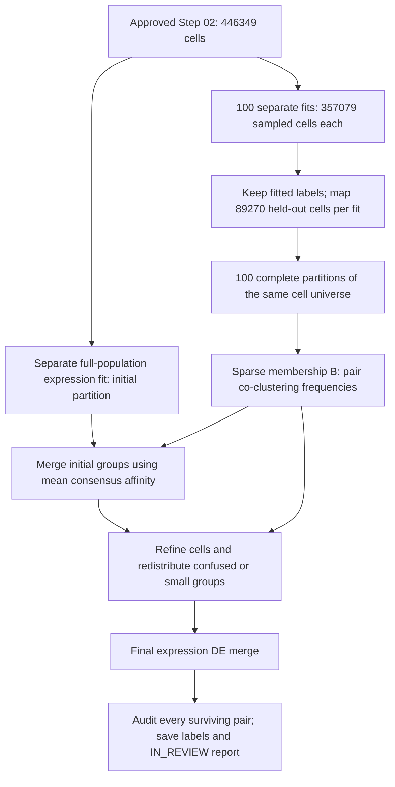

# PCDH19 HiCAT: exact parameters and how consensus is constructed

This is the methods guide for the **executed full-data run**, within HiCAT
stage **03 — `03_full_data_consensus_benchmark`**. Read it before interpreting
cluster counts or changing a parameter. The earlier pilot protocols document
different sample sizes/settings and must not be used as the production recipe.

The computation asks: **which cells repeatedly group together when expression
clustering is fitted on different 80% subsets?** It then merges/refines a
full-data partition using that evidence and checks expression separation.
There is no target cluster count, no vote on arbitrary cluster IDs, and no
requirement that 100 runs individually return the same number of clusters.

## 1. Authoritative configuration and code

The executed run is:

```text
/nfs/turbo/umms-parent/mgeo_neuron_scrnaseq_projectfolder/paper3_pcdh19/results/hicat/03_full_data_consensus_benchmark/consensus_restart_20260909_000256
```

Call this directory `RUN` below. Its **`config/run.json`**, per-iteration
`config.json`, `config/seeds.tsv`, frozen `adapter/hicat/` and pinned reference
source are authoritative for the completed calculation. The SHA256 of
`config/run.json` is
`f02f271f66e7dce1c56f2505cff4cfe06cafc8c142569aaaff2fbf97825f6e58`.
Repository code was byte-compared with the frozen engine/core/worker when this
guide was written; the documentation additions do not modify the run copies.

| Implementation | Exact identity / role |
| --- | --- |
| Allen Python `transcriptomic_clustering` | Commit `99154957c74023235763025fda9dc4eb3ca952c6`; HVGs, PCA, graph/community finding and expression DE primitives |
| Allen R `scrattch.hicat` | Commit `9af2f04cb837a7b53b005dee88a92eae337afead`; reference for held-out mapping and large-graph consensus control flow, ported into Python |
| Frozen adapter | Commit `305ce00711da7829c168ca7d53c669d0220f9587`; explicit orchestration, persistence and restart contracts |
| Environment | `RUN/config/environment.txt`; exact package versions, checked by workers |
| Annoy recovery | Separately hashed native seed bridge; preserves the original positive seeds instead of truncating/replacing them. [Recovery record](ANNOY_SEED_BINDING_RECOVERY.md) |

This is the documented Python implementation of the audited Allen procedure.
It is not a claim of numerical identity to an unchanged R/limma run. The
[source audit](HICAT_ALLEN_CONSENSUS_ALGORITHM_AUDIT.md) and
[pinned-source trace](HICAT_ALLEN_CONSENSUS_TECHNICAL_NOTES.md) disclose the
Python/R differences. Those files' original execution-status paragraphs are
historical; current execution state belongs in [the status](HICAT_PRODUCTION_STATUS.md).

## 2. scRNA-seq inputs and sample identity

- **446,349 cells × 19,071 genes**, from 12 dissected **E14.5 mouse MGE** samples.
- Input is approved primary-processing Step 02,
  `02_qc_filtering_20260830_124611_97e1bb5`. It applied the reviewed per-sample
  5-MAD low-count OR low-gene OR high-mitochondrial exclusion, removing 4,439
  cells and retaining every gene. [Primary-processing lineage](PCDH19_PRIMARY_PROCESSING_HANDOFF.md).
- Counts come from the original Cell Ranger filtered gene-expression matrices.
  The rejected Step 03 scDblFinder results and skipped Steps 04/05 do not enter.
- [The registered sample key](config/sample_key.csv) joins through
  `technical_sample_id`: JZ-1–3 = WT male; JZ-4–6 = WT female; JZ-7–9 = HET
  female; JZ-10–12 = KO male. Each group has three submitted samples.
- Sample/genotype/sex are reporting metadata. They do **not** select HVGs,
  construct the graph, define clusters, choose thresholds or enter consensus.
  Sampling is uniform over pooled cells, not 1,000 cells per sample and not
  balanced across genotype. Larger samples contribute more cells on average.
- No batch integration, cell-cycle regression, reference label transfer or
  predefined biological marker panel enters the fitter. Existing Step 06
  UMAP coordinates, when used, are a display—not the clustering space.

The sex-matched downstream contrasts are HET-F versus WT-F and KO-M versus
WT-M. Algorithm-internal cluster DE below is **not** sample-replicated
PCDH19 genotype DE. Submitted sample names do not prove litter/donor structure.
[Sample identity and design logic](PIPELINE_IO_AND_BIOLOGICAL_SCOPE.md#registered-biological-annotation-layer).

## 3. What each of the 100 iterations does

Each iteration samples **357,079 cells without replacement** (80% rounded to
an integer), fits HiCAT on those cells, then assigns **89,270 held-out cells**.
Different iterations overlap. They are independent seeded fits on overlapping
data, not 100 biological replicates and not 100 reruns on identical cells.

| Scientific control | Executed value / exact behavior | Why it matters |
| --- | --- | --- |
| Normalization target/base | `normalization_target=1000000`, natural log: `x_ig = ln(1 + 10^6 * count_ig / total_counts_i)` | All-gene totals; sparse float64 ln(1+CPM). Neither log2 nor Scanpy's common 10,000-count normalization. Raw integer counts remain in Step 02. |
| Gene eligibility | `low_thresh=1.0`, `min_gene_cells=4`: normalized expression **>1 in at least 4 node cells** | Eligibility is evaluated separately at every recursive node; it is not a global gene deletion from the saved input. |
| HVGs | `max_hvgs=3000` | Allen computes linear-CPM means/variances using `expm1(x)`, LOESS residuals of log-dispersion versus log-mean, normal-tail p-values and BH-adjusted ranking; returns up to 3,000 eligible genes. Its selection includes adjusted values `<1`, not a configured HVG FDR cutoff of 0.05. LOESS numerical defaults come from the pinned environment. |
| PCA fitting cells | `pca_fit_cells=all_cells_at_each_node` | Fit each node's representation on all its cells, not a hidden 4,000-cell sample. No gene-SD scaling or known-component removal is applied here. |
| PCA solver/dimensions | Randomized PCA, `pca_components=50`; upstream caps to `min(n_cells,n_selected_genes)-1` | Components are centered using saved gene means. The sparse adapter prevents an automatic switch to IncrementalPCA. |
| PC selection | `pc_filter=elbow`, `max_retained_pcs=20` | The pinned explained-variance elbow routine chooses the retained dimensions, capped at 20. This is not a fixed 20-PC fit. A zero-PC result fails. |
| Neighbor graph | `graph_k=15`, **effective k = min(15, retained PCs, node cells−1)** | The PC-dimension cap is inherited from this adapter. A node retaining six PCs uses k=6. Saved node summaries record actual values. |
| Neighbor search | Euclidean distance in retained PCs; Annoy, `annoy_trees=50` | Approximate neighbor lookup is seeded. This is not a graph on the UMAP. |
| Edge weights/community algorithm | Jaccard weights; `graph_backend=taynaud` Louvain; `graph_resolution=1.0` | Communities are candidate groups, subsequently DE-merged. Resolution does not set the final K. |
| Expression merge | Python empirical-Bayes DE; `merge_neighbors=2` | Nearby cluster pairs are prioritized from cluster centroids in the current representation. With >2 dimensions, upstream similarity is Pearson correlation; with ≤2 it uses normalized distance. |
| Minimum group size | `cluster_size_thresh=20` | Used for small-cluster merging and gene detection-count filtering; also used by consensus refinement. Distinct from the recursion eligibility threshold below. |
| Recursion | `min_recursive_cells=40` | Branches with fewer than 40 cells terminate. Otherwise local HVGs/PCA/graph/DE are fitted again. One surviving group terminates that branch. |
| Recursion safety | `max_depth_guard=20` | Reaching depth 20 raises an error; it is not accepted as convergence. |
| End of each fit | `final_cross_branch_merge=true` | Terminal groups undergo an additional merge using PCA on the accumulated fit-derived separation-gene union across all sampled cells. Recursive leaves alone are not the iteration endpoint. |
| Endpoint audit | `pairwise_final_validation=true` | Every final pair is evaluated; weak pairs are recorded without silently changing the partition. |

The code trace is [FullScaleEngine](scripts/hicat/fullscale_engine.py),
[local representation and merges](scripts/hicat/engine.py), and
[RestartRun.fit/mapping](scripts/hicat/consensus_restart.py).
Actual node-specific HVGs, PCs, effective k, cluster counts and reasons for
termination are saved under each fit attempt, not inferred from the maxima.

### Seeds and execution controls

Iteration 0 keeps sampling/fitting seed `20260908`. Iterations 1–99 use
`np.random.SeedSequence(20260908).spawn(99)`, with two generated uint32 values
per child: one sampling seed and one fitting seed. The exact schedule and
sampled row/ID files are frozen. Retries reuse those files; they do not draw
another sample. Each node uses its iteration's fitting seed.

`workers=1` is the Allen worker setting. SLURM requests 8 CPUs, 150 GiB,
48 hours and at most ten simultaneous iteration tasks; BLAS/OpenMP can use
8 threads. `block_cells=4096` bounds mapping/affinity/projection allocations.
These are execution/allocation controls, not biological thresholds or a
subsampling rule. The separate full-population initializer does not count as
one of the 100 membership iterations. Its fitting seed is `20260909`
(the original benchmark fit seed plus one). Post-consensus DE carries seed
`20260908`; the merge itself does not draw a new 80% sample.

## 4. Exact DE separation thresholds: q1, qdiff and score150

For each gene in a tested pair of clusters A/B:

```text
qA = fraction of A cells with ln(1+CPM) > 1
qB = fraction of B cells with ln(1+CPM) > 1
qdiff = abs(qA - qB) / max(qA, qB)     (0 when both are zero)
delta = mean_A[ln(1+CPM)] - mean_B[ln(1+CPM)]
```

The foreground is A for positive delta and B for negative delta. Qualifying
up- and down-regulated genes must pass **all** applicable criteria:

| Config key | Actual test |
| --- | --- |
| `q1_thresh=0.4` | Foreground detection fraction **>0.4** |
| `q2_thresh=null` | No independent background-detection ceiling |
| `qdiff_thresh=0.7` | Normalized detection contrast **>0.7**, not a 70-percentage-point difference |
| `cluster_size_thresh=20` | At least **20 foreground cells** above the expression-detection threshold for this gene |
| `padj_thresh=0.05` | Empirical-Bayes two-sided t-test **Holm-adjusted p <0.05**, across genes within each tested pair; this is not BH/FDR correction |
| `lfc_thresh=1.0` | **abs(delta)>1** on the mean-natural-log-expression scale; do not label this a log2 fold change or a ratio of arithmetic mean counts |
| `score_thresh=150` | Sum `-log10(adjusted p)` over qualifying up/down genes; no per-gene score cap in this Python implementation |
| `min_genes=5` | Declared endpoint audit requires **at least 5** qualifying genes, as well as score ≥150 |

Example: detection fractions 0.50 and 0.10 give qdiff=0.80 and pass both
fraction tests; 0.50 and 0.20 give qdiff=0.60 and fail. Passing those tests alone
is insufficient: expression difference, adjusted p and foreground cell count
must also pass. Exactly 0.4 or 0.7 fails the corresponding strict test.

The score pools qualifying genes in both directions. A large score can be
produced by very small adjusted p-values; it is not a posterior probability,
percent confidence, cluster count or a count of 150 marker genes. Gene p-values
use cells in the compared clusters, so they do not establish genotype effects
across biological samples.

**Pinned merge-control caveat:** `merge_clusters_by_de` sorts the tested
neighbor-pair scores and exits early if the lowest score is ≥150, before
checking gene counts. In a merging pass its inner stopping test uses
`score>=150 and num>5`, whereas the final audit uses `score>=150 and num>=5`.
Also, neighbor-based merging does not compare every possible pair on every
pass. Therefore it is inaccurate to claim that the merge loop guarantees all
surviving pairs pass a uniform “score150 AND five genes” rule. The independent
all-pairs audit is essential. A failed audit pair is preserved for review;
it is not silently merged or automatically accepted.

Source: pinned `transcriptomic_clustering/diff_expression.py`
(`filter_gene_stats`, `get_qdiff`, `calc_de_score`), `de_ebayes.py`
(`de_pairs_ebayes`), and `merging.py` (`merge_clusters_by_de`) beneath
`RUN/reference/allen_python/`.

### Which settings were chosen, inherited or only for display?

`q1=.4`, `qdiff=.7`, score150 and 100×80% fitting were explicitly selected for
this production analysis. They were **not estimated as optimal for these
samples**. The other fitting settings retain the qualified Python adapter
controls; the consensus thresholds below follow the audited Allen large-graph
branch. A changed setting creates a different analysis and requires a new
frozen run; editing a live repository JSON cannot change a running job.

The historical `marker_reporting` block (`top_n=20`, `max_fdr=.05`,
`min_delta_mean_log1p_cpm=.25`, `min_fraction_detected=.25`) belongs to ranked
marker reporting and does **not** replace the fitter's DE criteria above.
Likewise report DPI160, preview marker cap40 and inherited
`pilot_scratch_memory_gb=48` are not consensus separation thresholds. The
standalone R=98 review uses its separately declared display-only marker panel.

Some frozen `fitting` fields retain the original benchmark's metadata:
`executed_subsample_iterations=1`, `production_launch_authorized=false`,
`requires_user_approval_after_report=true`, and its original scope string.
They do not report current production progress. The worker uses top-level
`production_iterations=100`, selected execution mode and the separate
`AUTHORIZATION.json`; the latter records the later production authorization.
Per-iteration seeds override the original benchmark seed fields.

## 5. How the partitions become a consensus



### 5.1 Give every cell a label in every iteration

A fit learns clusters from its sampled cells. Using the fit-derived marker
union, calculate each sampled cluster's mean expression prototype. A held-out
cell receives the cluster whose prototype has the highest Pearson correlation
to that cell across those genes. Sampled labels remain unchanged.

Markers are the union of the **first 20 entries in each up/down gene list**
returned by saved fitting DE calls—not necessarily a ranked “top 20” list and
not the canonical biological review panel. Undefined correlations become zero;
exact ties use the first cluster in sorted numeric order. There is no rejection
threshold: even a poorly correlated held-out cell receives a label. Its score
and fitted/inferred flag are saved so this can be assessed. A one-cluster fit
has only one possible assignment and no invented perfect correlation score.

Thus consensus measures repeatability of **fitting plus held-out assignment**.
It is not based only on occasions when two cells happened to be sampled together.

### 5.2 Measure how often pairs stay together

Let R be the number of complete input partitions: **100 for production**,
**98 for the explicitly requested result using iterations 0–97**.

```text
P(i,j) = number of iterations assigning cells i and j to the same cluster / R
```

If two cells are together in 90 of 100 runs, P=0.90. If together in 90 of the
98 selected runs, P=90/98≈0.9184. Cluster `7` in one run does not need to match
cluster `7` in another; membership blocks have separate row identities.
The denominator includes every completed held-out assignment. Production
requires all 100 inputs; it does not silently average whichever fits succeeded.

We store a sparse one-hot matrix **B**, with one row per iteration-specific
cluster and one column per cell. Every column has exactly R ones. At R=100,
B contains **44,634,900 nonzeros**. Its row count is the sum of the 100 observed
cluster counts, not the consensus K. Conceptually `P=B.T @ B/R`, but the full
446,349×446,349 matrix is never materialized.

For a current target group C, the cell's mean consensus affinity is:

```text
A(i,C) = sum(P(i,j) for j in C) / number_of_cells_in_C
```

This includes self-pairs, following the audited source. With H the current
cell-to-group one-hot matrix, compute `B.T @ (B @ H)` and divide each target
column by `R * size(C)`, in cell blocks. This gives the exact N×K affinities
without allocating N×N. See [Membership.affinity](scripts/hicat/consensus_core.py).

### 5.3 Choose the actual consensus branch and starting groups

The first iteration's all-cell cluster sizes give
`G=sum(cluster_size**2)`. Observed iteration 0 has K=67 and
**G=13,657,640,939**, exceeding the **1,000,000,000** cutoff. Therefore this
run uses the **large-graph branch**: a separate expression fit of all 446,349
cells supplies the initial groups. The smaller representative-graph branch is
not executed. If selected, the current qualified worker would stop instead
of silently substituting a different algorithm.

Initial groups are learned from the full expression data. They are not fixed
pilot coarse parents, the 38/17 pilot partitions, or a chosen consensus K.

### 5.4 Merge groups with similar co-clustering patterns

`Membership.merge_by_co` computes mean within-group and between-group affinity.
A candidate pair is merged when both strict inequalities hold:

```text
between > 0.10
max(within_A, within_B) - between < 0.25
```

These thresholds are **code defaults**, not fields exposed in `config/run.json`.
The pass computes candidate statistics once, uses the audited R string-label
ordering (including its descending destination order), and relabels in that
order. It is not an iterative “recalculate until no edge exceeds 0.5” operation.

### 5.5 Refine assignments and handle weak groups

`Membership.refine` uses these executed controls:

| Control | Exact behavior |
| --- | --- |
| Assignment | Choose the current group with maximum mean consensus affinity; ties follow sorted group IDs |
| `niter=50` | At most 50 assignment updates per inner refinement loop |
| `tol_th=.01` | Stop before accepting an update when fewer than 1% of cells would change |
| Additional stopping rule | Stop before updating if the number matching their current group no longer increases |
| Cell cohesion | Affinity to its assigned group |
| Cell separability | Own-group affinity minus the strongest competing-group affinity |
| Cell confusion | Strongest competing-group affinity / own-group affinity; zero when denominator is zero |
| `confusion_th=.6` | Remove a group from the candidate partition if its **median cell confusion >.6** |
| `min_cells=20` | Also remove groups containing **<20 cells** |
| Redistribution | Reassign cells from removed groups among retained groups, using the current affinities; repeat refinement |

“Remove a group” does **not** delete its cells. Every cell is retained. The
all-groups-removed edge case collapses to a single group rather than dropping
the population. The code has an outer-loop failure guard. Defaults .6, 50 and
.01 live in `consensus_core.py`; the worker explicitly passes minimum size20.
No K convergence target or majority-vote cutoff is imposed.

### 5.6 Finish with expression separation and an audit

After consensus refinement, the worker compares groups using expression DE
again. Nearby pairs are prioritized in **marker-expression space from the
full-population initializer**. This differs from the **marker-PCA**
cross-branch merge performed inside each individual fit. All assigned cells
contribute expression means, detection and sample variances; the configured
Python eBayes and q1/qdiff/score controls apply.

Finally every remaining pair is audited. The endpoint is a saved partition,
with complete pair evidence and unresolved-pair counts, marked for review.
It does not become an accepted biological taxonomy automatically.

The completed **R=98 example** followed this sequence: refinement had 42 groups,
redistributed seven confused/small groups, and ended at 35; final expression
DE merged to **34 groups**, with **3 of 561 pairs** below the declared
separation criteria. The final inner trace stopped with 443,999/446,349 cells
matching the proposed assignment (2,350 would change, <1%); because the check
happens before updating, that last proposed update was not applied. These are
measurements of R=98, not a claim that R=100 must produce the same endpoint.
[Exact R=98 review and source artifacts](HICAT_CONSENSUS_REVIEW_HANDOFF.md).

## 6. What “done” means and where to inspect evidence

| State / asset | Meaning |
| --- | --- |
| 100 iteration jobs completed; fit/mapping seals published | 100 full-population input partitions are available. Combined consensus can still be pending/running. |
| `final/production/aggregation/CURRENT.json` | Successful combined memberships, co-merging, refinement and all-cell assignments before final DE |
| `final/production/DE/CURRENT.json` | Successful post-consensus expression merge and final all-pair audit |
| Versioned review `outputs/STEP_STATUS.json` | Published report remains `IN_REVIEW`; successful computation is not biological approval |
| `iterations/NNN/config.json`, sampled row/ID files | Exact seed, selected cells and frozen settings for one fit |
| Fit attempt `feature_selection.tsv`, PCA files, node summaries, recursion tree, DE tables | What was actually selected, split and merged, with per-node dimensions |
| Mapping attempt `all_cell_assignments.tsv.gz`, `membership_B.npz`, `membership_index.json` | Sampled/inferred labels, correlations and reusable one-hot membership |
| Aggregation attempt `membership_index.json` | Exact parent input paths/seals and denominator |
| `merge_actions.json`, `refinement_trace.json` | Why groups changed and why refinement stopped |
| `cell_consensus_diagnostics.tsv.gz`, `cluster_consensus_diagnostics.tsv` | Cohesion/separability/confusion **at the pre-final-DE refinement endpoint**; do not silently relabel these as post-DE metrics |
| Final DE attempt `pairwise_DE.tsv`, means/detection tables, `all_cell_assignments.tsv.gz` | Final IDs, expression evidence and flagged weak pairs |

Resolve each `CURRENT.json` to its immutable successful attempt. A per-run
`C0001` ID is assigned by ordered cell membership, not biological identity;
compare partitions by aligned cell overlap, not equality of their ID strings.
The expression dendrogram in the report summarizes cluster means; it is not
the fitted recursion tree or the consensus procedure itself.

## 7. Code navigation and change boundaries

| Source | Responsibility |
| --- | --- |
| [engine.py](scripts/hicat/engine.py) | `_representation`, `_merge`, `_capture_de`, `run`: local features/PCA, DE control, fit markers, cross-branch merge and endpoint audit |
| [fullscale_engine.py](scripts/hicat/fullscale_engine.py) | Sparse statistics, all-node PCA allocation, block projection and recursive memory management |
| [consensus_core.py](scripts/hicat/consensus_core.py) | `map_heldout`, `Membership.from_blocks`, `affinity`, `merge_by_co`, `refine`: exact numerical consensus operations |
| [consensus_restart.py](scripts/hicat/consensus_restart.py) | Fit/mapping/aggregation/DE checkpoint orchestration and actual arguments passed |
| [checkpoints.py](scripts/hicat/checkpoints.py) | Input/output contracts, manifests, checksums, reopening and independent restart |
| [manage_consensus_iterations.py](bin/manage_consensus_iterations.py) | Seed schedule, frozen cell selections and original run package preparation |
| [consensus review protocol](HICAT_CONSENSUS_REVIEW_PROTOCOL.md) | Same-stage numbered reporting, sample/source tables and atomic publication |

For a later rerun, change the preparation configuration/code that actually
supplies the parameter, qualify the change, and freeze a **new** run. In
particular, consensus .1/.25/.6/.01/50 are currently code-level defaults;
adding a similarly named JSON key alone would not change their behavior.
The restart worker also explicitly passes `score_thresh=150` when constructing
iteration/final-DE engines; its final audit explicitly tests score≥150 and
num≥5. Those call-site constants must be reconciled with configuration in any
future parameter-changing implementation, rather than assuming JSON alone
controls every occurrence.
Never edit the active run's frozen JSON, seed files, input matrices, code or
completed attempts. This guide adds documentation only.
