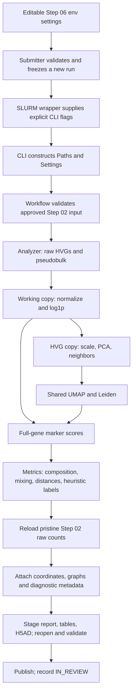

# Step 06: code walkthrough and tuning guide

Step 06 asks how the 12 registered samples relate in an **unintegrated** expression representation. It computes diagnostics and automatic provisional labels; it does not establish that batch effects are absent, establish technical causation, or finalize cell identities. The successful result remains `IN_REVIEW`.

Start with the execution map below, then the parameter tables. Every Step 06 Python module, class, and function has documentation; functions use NumPy-style Parameters, Returns/Yields, Notes, and selected Raises sections. Comments identify important transformations and code-only decisions. The function index at the end links directly to the implementation.

This guide documents the repository's Step 06 implementation. The September 3 run `06_technical_sample_batch_diagnostics_20260903_114110_6087eeb`, job `59983804`, executed its own frozen source. Repository documentation changes do not modify that run, its checkpoint, or its results. Later repository code includes live progress instrumentation that the original job did not have. For exact historical behavior, read that run's `code/primary_processing/` and `config/` snapshots.

## Follow the execution



| Responsibility | Where to read | What to look for |
| --- | --- | --- |
| Source settings and scheduler resources | [primary_processing_step06.env](config/primary_processing_step06.env) | Every setting has a comment describing its role. |
| Validate submission and freeze inputs/code | [submit_primary_processing_step_06.sh](bin/submit_primary_processing_step_06.sh) | Exact input guards, version checks, snapshot copies, final `sbatch` call. |
| Execute frozen source | [primary_processing_06_diagnostics.sbatch](slurm/primary_processing_06_diagnostics.sbatch) | `PYTHONPATH`, thread controls, env-to-CLI mapping, success/failure markers. |
| Parse and route arguments | [step06_cli.py](scripts/primary_processing/step06_cli.py) | `parser()` and `main()` separate identity/paths from settings. |
| Understand every phase in order | [step06_workflow.py](scripts/primary_processing/step06_workflow.py) | `Step06Workflow.run()` is the top-level trace. |
| Compute expression representations and states | [step06_analysis.py](scripts/primary_processing/step06_analysis.py) | `Step06Analyzer.run()`, `marker_programs()`, `ProgramScorer.score()`. |
| Understand numerical summaries and automatic decisions | [step06_metrics.py](scripts/primary_processing/step06_metrics.py) | `NeighborhoodDiversity.calculate()`, `_sample_decisions()`, `_outcome()`. |
| Render report pages | [step06_plots.py](scripts/primary_processing/step06_plots.py) | Page builders A–D, E–G, H–I, J–L. |
| Understand integrity checks | [step06_validation.py](scripts/primary_processing/step06_validation.py) | Input, artifact, serialized-output and direct runtime-boundary checks. |
| Understand output publication | [step06_publishing.py](scripts/primary_processing/step06_publishing.py) | Staging, manifests, report text and separate approval-ledger update. |
| Trace a future running job | [step06_progress.py](scripts/primary_processing/step06_progress.py), [step06_progress_cli.py](scripts/primary_processing/step06_progress_cli.py) | START/COMPLETE/FAILED events with parameters, dimensions, outputs and timing. |

The approved input is Step 02 raw counts: **446,349 cells × 19,071 genes**. Step 03 was rejected and Steps 04–05 were skipped. Step 06 reads their decision/ledger evidence, not their expression outputs. Shared helpers from earlier modules supply `ValidationLedger`, raw sparse matrix fingerprints, and the docstring-presence audit; their algorithms are unchanged by this documentation update.

## Track the data representation

| Stage | Representation and cell/gene scope | Changes and downstream use |
| --- | --- | --- |
| Load input | Sparse integer raw counts; all cells and genes | Input identity, lineage and metadata checks. |
| Select HVGs | Raw counts; select 3,000 genes without deleting genes | `seurat_v3` with registered technical sample as `batch_key`; affects features, not batch correction. |
| Aggregate pseudobulk | Sum raw counts by sample over selected HVGs | Divide by the sum **over those HVGs**, multiply by 1,000,000, then natural `log1p`; used for sample Pearson correlations. |
| Normalize working object | All cells/genes | Per-cell total to 10,000, then natural `log1p`; this mutates only in-memory working `X`. |
| Scale HVG copy | All cells × 3,000 HVGs | SD scaling without mean subtraction, upper clipping at 10. PCA subsequently centers this matrix. |
| PCA | All cells × 50 PCs | Centered ARPACK PCA; same PCs enter neighbors. |
| Neighbors | All cells × all cells, sparse | Cosine distances; `k=30`, UMAP connectivity construction; no integration. |
| UMAP and Leiden | One global graph | UMAP is display geometry; Leiden produces descriptive clusters from the graph. |
| Marker programs | Full-gene log1p expression, not scaled HVGs | Program means standardized across cells, averaged by cluster, highest program wins. |
| Metrics | All retained cells | Raw QC, sample centroids, state composition, graph mixing, sample similarities and heuristics. |
| Render | Up to 120,000 cells, balanced across samples | Only display is sampled; coordinates/results have already been calculated on all cells. |
| Assemble output | Fresh reload of approved raw counts | Attach metadata, PCA/UMAP, graphs and HVG flags. Published `X` stays raw; no normalized layer is saved. |

The raw-count reload in `Step06Workflow.run()` is important: the analyzer's transformed matrix is discarded, rather than written as the checkpoint's `X`. Input/output logical sparse-count fingerprints are compared after writing and reopening the H5AD.

For the actual saved object's slot-by-slot contents and every nested `.uns`
field, read the [saved AnnData inventory](STEP06_SAVED_ANNDATA.md). It includes
an exact decoded metadata snapshot and distinguishes inherited Step 00–02
history from Step 06 metadata. In particular, the inherited `latest_step`
still says Step 02, and the original `forbidden_operations` list is historical;
neither accurately describes the entire current checkpoint. Normalized/scaled
matrices and PCA gene loadings are not persisted. Keep the full run package
because `.uns` contains selected parameters, not complete fitted models or
all provenance.

## Configurable controls

Edit [config/primary_processing_step06.env](config/primary_processing_step06.env) for a future versioned run. The submitter snapshots values into `submitted_step06.env` and `resolved.env`; the wrapper converts them to CLI arguments, and `Step06Settings` receives those resolved arguments. Editing repository configuration cannot retune an already-submitted run.

For example:

```text
PRIMARY_PROCESSING_STEP06_N_NEIGHBORS=30
    -> --n-neighbors 30
    -> Step06Settings.n_neighbors
    -> scanpy.pp.neighbors(..., n_neighbors=30)
    -> graph -> entropy, UMAP, Leiden -> state composition/report
```

All parameter names below are suffixes of `PRIMARY_PROCESSING_STEP06_` in the env file. They map to lowercase underscore dataclass fields and lowercase hyphen CLI options. Production values are shown; the standalone Python dataclass uses `n_jobs=1`, while the production env passes `32`.

| Env suffix / value | What it controls | What a change affects |
| --- | --- | --- |
| `TARGET_SUM=10000` | Per-cell total before natural log1p | Expression representation, PCA/graph and marker scores; raw pseudobulk aggregation occurs before this. |
| `HVG_FLAVOR=seurat_v3` | Feature-selection algorithm on raw counts | Not freely interchangeable: other flavors can expect a different input representation. Review the code path before changing. |
| `N_TOP_GENES=3000` | Number of features selected across samples | PCA/graph and HVG-restricted pseudobulk similarity; all genes still remain in the checkpoint. |
| `PCA_COMPONENTS=50` | PCs fitted and used for neighbors | Graph, mixing, UMAP, clustering; inspect `pca_variance_ratio.tsv` when considering changes. |
| `CENTROID_COMPONENTS=20` | First PCs used for sample-center distances | Sample displacement flags, composition-distance correlation and global headline; does not change the graph. |
| `N_NEIGHBORS=30` | Locality of the graph | Larger neighborhoods summarize broader structure; changes entropy, UMAP and Leiden. Stored neighbor count need not equal the requested value. |
| `NEIGHBOR_METRIC=cosine` | Cell-to-cell distance in PCA space | Entire graph and its downstream products; PCA sample-center distances remain Euclidean. |
| `UMAP_MIN_DIST=0.3` | Packing of the UMAP layout | Coordinates and UMAP displacement flags; not graph entropy or Leiden on the fixed graph. |
| `UMAP_SPREAD=1.0` | UMAP layout scale | Coordinates and UMAP displacement flags, not the PCA or graph. |
| `LEIDEN_RESOLUTION=1.0` | Descriptive cluster granularity | Cluster labels, marker winners, state proportions and composition-based flags; no cell removal. |
| `RANDOM_SEED=20260903` | Reproducibility seed | Passed to PCA, neighbors, UMAP, Leiden and display sampling; compare seed sensitivity rather than select a pleasing picture. |
| `SAMPLE_FIELD=technical_sample_id` | HVG, pseudobulk, mixing and summary grouping | Changes the meaning of the diagnostic. Registered samples do not by themselves establish independent embryos/litters. |
| `GENOTYPE_FIELD=genotype` | Registered genotype labels | Summary and display grouping; not a PCA predictor or correction covariate. |
| `SEX_FIELD=sex` | Registered sex labels | Summary and display grouping. |
| `DESIGN_FIELD=design_group` | Registered experimental groups | Summary/display labels. |
| `RENDER_MAX_CELLS=120000` | Balanced plotting subset cap | Scatter plots and panel J boxplot only; smaller samples are kept in full and unused quotas are not redistributed. |
| `PLOT_DPI=180` | PNG output resolution | Figure file size and appearance. |
| `COMPRESSION=lzf` | H5AD codec | File size/I/O time; numerical counts remain the same. |
| `N_JOBS=32` | Scanpy worker setting | Execution performance; not every underlying algorithm necessarily uses this worker count. |

`EXPECTED_CELLS`, `EXPECTED_GENES`, `STEP02_RUN_ID`, `STEP02_CHECKPOINT`, `INPUT_BYTES`, and `INPUT_SHA256` are **input identity guards**, not tuning knobs. Changing them to bypass a mismatch would change which data are accepted.

Scheduler controls `CPUS=32`, `MEMORY=512G`, `WALLTIME=3-00:00:00`, and `PARTITION=largemem` affect execution resources. `CPUS` also supplies the wrapper's OMP/BLAS/MKL/Numba thread limits. `PRIMARY_PROCESSING_PYTHON_BIN` chooses the pinned interpreter; the submitter checks package versions against the requirements file.

The existing input validator checks positive workers, `2 <= PCA_COMPONENTS < N_TOP_GENES`, `1 <= CENTROID_COMPONENTS <= PCA_COMPONENTS`, `2 <= N_NEIGHBORS < EXPECTED_CELLS`, and a positive rendering cap. These checks are not exhaustive parameter validation. In particular, the render sampler takes at least one cell per sample; a cap smaller than the sample count can fail the later output cap check.

## Code-only choices: not exposed as env/CLI settings

These are documented next to the implementation. Changing them requires a source change and a new frozen run. The settings TSV alone does not capture all of them; the frozen source is the full record.

| Location | Current choice | Interpretation / tuning consequence |
| --- | --- | --- |
| `marker_programs()` | Ten fixed programs and overlapping mouse marker tuples | Defines the available provisional states. Full input validation requires all listed genes to be present. |
| `ProgramScorer.score()` | Mean log expression; population-SD standardization (`ddof=0`); cluster mean; `idxmax` winner | No control-gene subtraction, confidence margin, minimum score or unknown class. Ties use first program order. |
| `Step06Analyzer.run()` scaling | `zero_center=False`, `max_value=10` | SD scaling and clipping before PCA; changing clipping changes the representation. |
| PCA call | `zero_center=True`, `svd_solver="arpack"` | Centered PCA on scaled HVGs. |
| Neighbor call | `method="umap"` | Connectivity construction; distance edges feed mixing, connectivities feed Leiden. |
| Leiden call | `flavor="igraph"`, `directed=False`, `n_iterations=2` | Algorithm/backend choices and optimization duration; resolution alone is not the full contract. |
| `PseudobulkBuilder.build()` | HVG-only count denominator; `1_000_000` multiplier; natural `log1p` | Sample similarity over selected features, not a whole-panel CPM denominator or differential expression test. |
| `NeighborhoodDiversity.calculate()` | Equal weight per stored distance edge; natural log; divide entropy by `ln(S)` | No distance weighting, expected-mixing adjustment or null-model calibration. |
| `_sample_decisions()` displacement | Median + `3 × unscaled MAD`, independently for PCA and UMAP | Relative outlier flag across sample centers; differs from scaled-MAD Step 02 QC. |
| `_sample_decisions()` represented state | At least `100` cells **and** `1%` of sample | Thresholds define reporting only. |
| `_sample_decisions()` missing state | At least `1%` globally **and** (`<50` cells **or** `<0.1%` of sample) | A flag for inspection, not proof a state is biologically absent. |
| `_outcome()` | Entropy `0.65`, distance ratio `2`, correlation `0.5`; ordered branches | Heuristic global headline; see exact rule below. |
| Plot page builders | Fixed colors/grids/fonts/scatter settings | Presentation knobs; E–G currently accommodates at most 12 sample facets. |

### How provisional biological labels are assigned

1. For each cell, average log1p-normalized expression across each program's marker genes in the **full gene set**.
2. For each program separately, standardize those cell scores across the entire dataset using population standard deviation.
3. Average the standardized scores within each Leiden cluster.
4. Assign the program with the highest cluster mean to every cell in that cluster.

This is a relative winner rule. It can produce a label with weak absolute evidence, and all cells in a cluster share the assigned label. Programs overlap; “MGE identity” is an identity axis competing with developmental and non-neural states. The scores do not constitute probabilities, HiCAT annotations, or independently validated cell types. The per-cell saved `program_*` columns are unstandardized mean-log scores; the cluster table contains standardized means. Read `marker_program_scores_by_cluster.tsv` to trace each winner.

### How the automatic report headline is assigned

`Step06MetricBuilder._outcome()` takes all-cell entropy, sample-center distances, and provisional-state counts. It evaluates these branches **in order**:

```text
if median normalized neighborhood entropy >= 0.65
   and largest PCA sample-center distance <= 2 × median pairwise distance:
    outcome 1: "Minimal sample-associated structure"
elif correlation(PCA center distances, state-composition distances) >= 0.5:
    outcome 3: "Strong sample differences potentially caused by biological
                composition or confounding"
else:
    outcome 2: "Clear sample-associated technical structure
                superimposed on shared biology"
```

PCA distances use the first 20 PCs by default. State-composition distances are Jensen–Shannon distances between each sample's state proportions; their association with PCA distances is Pearson correlation over unique off-diagonal sample pairs. The first passing branch wins, even if composition correlation is also high.

**These thresholds are descriptive heuristics, not calibrated statistical criteria.** No inferential tests are run. Outcome 1's distance ratio does not establish small absolute separation. Entropy is not adjusted for unequal sample sizes. Pairwise distances are not independent replicates. Outcome 2 is a fallback; its wording implies technical causation that the rule cannot establish. A code or threshold change should be assessed against the underlying tables and biological design, rather than judged by which headline it produces.

The original run's median normalized entropy was approximately `0.709`, and it received outcome 1. This remains an automatic, unreviewed conclusion.

### What neighborhood mixing means

For each cell, count the samples represented among its stored distance-graph neighbors. Let `p_s` be the proportion from sample `s`, and let `S` be the total number of registered samples:

```text
H = -sum(p_s * ln(p_s))
normalized_entropy = H / ln(S)
effective_samples = exp(H)
inverse_Simpson = 1 / sum(p_s**2)
```

An entropy of zero means all counted neighbors come from one sample; normalized entropy of one means equal representation across all registered samples. Equal representation is not the expected random-mixing distribution when sample sizes differ. Higher mixing can also hide biological differences. Stored edges are counted equally regardless of distance magnitude. Empty neighborhoods are numerically protected by the implementation, but their diversity values would not be meaningful; the current output validator checks graph shape, not that every row has neighbors.

## Trace a report finding back to code

| Finding / panel | Numerical source under `tables/` | Implementation |
| --- | --- | --- |
| A: sample counts; B: QC | `sample_metadata_and_cells.tsv`, `qc_summary_by_sample.tsv` | `Step06MetricBuilder.build()` on original metadata |
| C–D: PCA / sample centers | `pca_variance_ratio.tsv`, `pca_centroids.tsv`, `pca_centroid_distances.tsv`; H5AD `obsm['X_pca']` | Analyzer PCA, metric builder centroid summaries |
| E–G: shared UMAP | H5AD `obsm['X_umap']`, `rendering_cell_ids.tsv.gz` | Analyzer UMAP, `_page_e_g()` |
| H: provisional states | `marker_program_scores_by_cluster.tsv`; H5AD `obs['step06_provisional_state']` | `ProgramScorer.score()` then cluster-label broadcast |
| I: sample/state composition | `provisional_state_counts.tsv`, `provisional_state_within_sample_percentages.tsv`, `provisional_state_within_state_percentages.tsv` | `Step06MetricBuilder.build()` |
| J: mixing | `local_sample_diversity_per_cell.tsv.gz`, `local_sample_diversity_summary.tsv`, `local_sample_diversity_by_state.tsv` | `NeighborhoodDiversity.calculate()` |
| K: sample expression similarity | `pseudobulk_logcpm_hvgs.tsv.gz`, `pseudobulk_correlations.tsv` | Raw HVG pseudobulk then Pearson correlation |
| L: per-sample flags | `preintegration_sample_decisions.tsv` | `_sample_decisions()` |
| L: global headline | Run `STEP06_DIAGNOSTIC_REPORT.md`; H5AD `uns['step06_diagnostics']` | `_outcome()`; this is separate from per-sample flags |
| Runtime settings and checks | `analysis_parameters.tsv`, `software_versions.tsv`, `validation_checks.tsv` | Settings snapshot, package metadata, validation ledger |

The primary PDF is `figures/step06_primary_diagnostic_report.pdf`; four PNG page previews accompany it. Scatter plots and the panel J boxplot use the balanced display subset. The tables, sample centers, counts and printed global mixing medians use all cells. A passing validation ledger checks implementation invariants; it does not certify biological labels or heuristic conclusions.

## Inspect before deciding what to tune

- To understand the broad expression representation, start with HVGs, scaling, variance explained and the number of PCs. These choices precede every graph-based interpretation.
- To inspect local mixing, examine `N_NEIGHBORS`, the metric and PC count together, with the unequal sample sizes and provisional-state composition in view. UMAP appearance alone cannot validate mixing.
- To examine provisional labels, inspect cluster marker means and the overlapping marker lists before changing Leiden resolution. A highest-score rule cannot report uncertainty without a code change.
- To examine the “minimal structure” headline, inspect actual pairwise distances, entropy distributions and individual sample flags. The existing threshold values are not validated cutoffs to optimize toward.
- To improve figure readability, use rendering size/DPI and the plot builders. These changes need not alter scientific thresholds.

No parameter changes or reruns are made by this documentation update. For future experiments, state the question, vary a small set of controls, and preserve the exact input, settings, software, and seed with each versioned run. The existing workflow requires review before advancing to another major step.

## Inspect progress without starting a job

From the repository root, this prints available progress-viewer options only:

```bash
PYTHONPATH=paper3_pcdh19/scripts /home/elcrespo/miniconda3/envs/mge-organoid-python/bin/python \
  -m primary_processing.step06_progress_cli --help
```

For a later instrumented run, add `--run-dir /absolute/path/to/run --follow --details` instead of `--help`. The viewer only reads logs. Follow mode ends when the workflow records COMPLETE/FAILED; a killed process may leave no terminal event and require stopping the viewer manually. Job `59983804` has only its original coarse logs, not these live events.

Events include the operation label, exact logged parameters/representation, dimensions, output metadata, elapsed time and process-lifetime peak memory. Some labels, such as `Step06Workflow.attach_diagnostics`, name an inline logical block rather than a standalone function. `max_rss_gb` is a legacy field name for Linux peak RSS converted to GiB; it is not per-function memory usage.

The submitter also offers `--dry-run`, which performs input/environment checks and exits before run creation or submission. Its earlier `compileall` can write Python bytecode caches, so it is not a completely write-free command. Actual submission requires a clean Git commit. Default submission creates a new versioned run; `--replace-run` deletes the selected inactive run's contents and is not needed to read code or documentation.

Publication performs individual atomic renames for output groups, then updates the approval ledger separately. It is not a single all-or-nothing transaction across the entire run. Failure cleanup removes remaining staging, not already-published groups.

## Function index

The following links cover every Step 06 module, class, and function. Module docstrings provide the overview; function docstrings explain inputs, results, side effects, fixed choices and limitations. Types describe the actual contracts used here; they do not imply broader support than the validators and code provide.

### [step06_analysis.py](scripts/primary_processing/step06_analysis.py)

| Definition | Purpose |
| --- | --- |
| [`marker_programs`](scripts/primary_processing/step06_analysis.py#L27) | Return the fixed broad marker programs used for descriptive states. |
| [`PseudobulkBuilder`](scripts/primary_processing/step06_analysis.py#L60) | Aggregate all raw counts by sample and return log-CPM expression. |
| [`PseudobulkBuilder.build`](scripts/primary_processing/step06_analysis.py#L71) | Calculate sample pseudobulks using every retained cell. |
| [`ProgramScorer`](scripts/primary_processing/step06_analysis.py#L117) | Calculate transparent mean-log-expression programs and cluster labels. |
| [`ProgramScorer.score`](scripts/primary_processing/step06_analysis.py#L127) | Return per-cell scores and cluster-level standardized program means. |
| [`RenderingSampler`](scripts/primary_processing/step06_analysis.py#L186) | Choose a deterministic balanced subset exclusively for plotting. |
| [`RenderingSampler.__init__`](scripts/primary_processing/step06_analysis.py#L196) | Store the fixed cap and random seed. |
| [`RenderingSampler.select`](scripts/primary_processing/step06_analysis.py#L212) | Return selected cell IDs with their full-data row positions. |
| [`Step06Analyzer`](scripts/primary_processing/step06_analysis.py#L250) | Run the documented diagnostic workflow without batch correction. |
| [`Step06Analyzer.__init__`](scripts/primary_processing/step06_analysis.py#L261) | Store immutable settings and the run-scoped progress publisher. |
| [`Step06Analyzer.run`](scripts/primary_processing/step06_analysis.py#L280) | Compute HVGs, PCA, neighbors, UMAP, Leiden, states, and pseudobulk. |

### [step06_cli.py](scripts/primary_processing/step06_cli.py)

| Definition | Purpose |
| --- | --- |
| [`parser`](scripts/primary_processing/step06_cli.py#L19) | Construct the explicit approved-input and diagnostic parameter contract. |
| [`main`](scripts/primary_processing/step06_cli.py#L54) | Run the frozen Step 06 workflow and report its review boundary. |

### [step06_metrics.py](scripts/primary_processing/step06_metrics.py)

| Definition | Purpose |
| --- | --- |
| [`_long_square`](scripts/primary_processing/step06_metrics.py#L27) | Convert a labeled square matrix to a stable long-form table. |
| [`NeighborhoodDiversity`](scripts/primary_processing/step06_metrics.py#L55) | Measure local biological-sample diversity on the unintegrated graph. |
| [`NeighborhoodDiversity.calculate`](scripts/primary_processing/step06_metrics.py#L66) | Return per-cell entropy/effective-sample metrics and summaries. |
| [`Step06MetricBuilder`](scripts/primary_processing/step06_metrics.py#L134) | Build every numerical companion table required by the review contract. |
| [`Step06MetricBuilder.__init__`](scripts/primary_processing/step06_metrics.py#L145) | Store immutable settings. |
| [`Step06MetricBuilder.build`](scripts/primary_processing/step06_metrics.py#L161) | Calculate composition, QC, sample similarity, mixing, and decisions. |
| [`Step06MetricBuilder._sample_decisions`](scripts/primary_processing/step06_metrics.py#L305) | Create a transparent per-sample review summary without integrating. |
| [`Step06MetricBuilder._outcome`](scripts/primary_processing/step06_metrics.py#L394) | Choose one transparent provisional outcome for human review. |

### [step06_models.py](scripts/primary_processing/step06_models.py)

| Definition | Purpose |
| --- | --- |
| [`Step06Settings`](scripts/primary_processing/step06_models.py#L25) | Store environment/CLI-controlled scientific and rendering settings. |
| [`Step06Paths`](scripts/primary_processing/step06_models.py#L81) | Resolve approved inputs, bypass evidence, and run-scoped outputs. |
| [`Step06Artifacts`](scripts/primary_processing/step06_models.py#L106) | Carry full-cell analysis products into metrics and publication. |
| [`Step06Results`](scripts/primary_processing/step06_models.py#L129) | Bundle companion tables and the provisional diagnostic conclusion. |

### [step06_plots.py](scripts/primary_processing/step06_plots.py)

| Definition | Purpose |
| --- | --- |
| [`Step06Palette`](scripts/primary_processing/step06_plots.py#L31) | Provide fixed colors for samples and biological design variables. |
| [`Step06Palette.__init__`](scripts/primary_processing/step06_plots.py#L41) | Create stable mappings from sorted labels. |
| [`Step06ReportPlotter`](scripts/primary_processing/step06_plots.py#L67) | Assemble one primary multi-page A-L report from shared coordinates. |
| [`Step06ReportPlotter.__init__`](scripts/primary_processing/step06_plots.py#L78) | Store plotting settings, output location, and progress publisher. |
| [`Step06ReportPlotter.publish`](scripts/primary_processing/step06_plots.py#L102) | Write the primary PDF and page previews with a manifest. |
| [`Step06ReportPlotter._page_a_d`](scripts/primary_processing/step06_plots.py#L198) | Create panels A-D for composition, QC, PCA, and centroids. |
| [`Step06ReportPlotter._page_e_g`](scripts/primary_processing/step06_plots.py#L280) | Create panels E-G from one shared global UMAP. |
| [`Step06ReportPlotter._page_h_i`](scripts/primary_processing/step06_plots.py#L333) | Create panels H-I for provisional biology and sample contributions. |
| [`Step06ReportPlotter._page_j_l`](scripts/primary_processing/step06_plots.py#L393) | Create panels J-L for mixing, similarity, and decision review. |
| [`Step06ReportPlotter._categorical_scatter`](scripts/primary_processing/step06_plots.py#L477) | Draw one rasterized categorical scatter with stable colors. |
| [`Step06ReportPlotter._pca_scatter`](scripts/primary_processing/step06_plots.py#L515) | Draw one view of the exact shared unintegrated PCA coordinates. |

### [step06_progress.py](scripts/primary_processing/step06_progress.py)

| Definition | Purpose |
| --- | --- |
| [`_utc_now`](scripts/primary_processing/step06_progress.py#L27) | Return a timezone-aware UTC timestamp for one progress event. |
| [`_json_default`](scripts/primary_processing/step06_progress.py#L43) | Convert paths and scalar-like scientific values to JSON-safe values. |
| [`Step06ProgressContext`](scripts/primary_processing/step06_progress.py#L70) | Collect outputs that become part of a completed function event. |
| [`NullStep06ProgressTracker`](scripts/primary_processing/step06_progress.py#L82) | Provide the progress API for isolated unit-level use without file output. |
| [`NullStep06ProgressTracker.track`](scripts/primary_processing/step06_progress.py#L93) | Yield an in-memory context without publishing progress events. |
| [`NullStep06ProgressTracker.note`](scripts/primary_processing/step06_progress.py#L123) | Accept an instantaneous event without publishing it. |
| [`Step06ProgressTracker`](scripts/primary_processing/step06_progress.py#L153) | Write durable JSONL events and an atomically refreshed latest-event file. |
| [`Step06ProgressTracker.__init__`](scripts/primary_processing/step06_progress.py#L164) | Initialize a new run-scoped append-only event stream. |
| [`Step06ProgressTracker.track`](scripts/primary_processing/step06_progress.py#L190) | Record START and COMPLETE/FAILED events around one major function. |
| [`Step06ProgressTracker.note`](scripts/primary_processing/step06_progress.py#L247) | Record one instantaneous informational event. |
| [`Step06ProgressTracker._write`](scripts/primary_processing/step06_progress.py#L276) | Append, flush, and fsync one event before refreshing latest state. |

### [step06_progress_cli.py](scripts/primary_processing/step06_progress_cli.py)

| Definition | Purpose |
| --- | --- |
| [`parser`](scripts/primary_processing/step06_progress_cli.py#L18) | Construct the run-directory, follow, and detail display options. |
| [`Step06ProgressViewer`](scripts/primary_processing/step06_progress_cli.py#L40) | Read and print new records from one append-only Step 06 event ledger. |
| [`Step06ProgressViewer.__init__`](scripts/primary_processing/step06_progress_cli.py#L50) | Resolve the run-scoped ledger and display mode. |
| [`Step06ProgressViewer.show`](scripts/primary_processing/step06_progress_cli.py#L69) | Print all existing events and optionally follow new events. |
| [`Step06ProgressViewer._terminal`](scripts/primary_processing/step06_progress_cli.py#L118) | Return whether a workflow-level event declares terminal state. |
| [`Step06ProgressViewer._print`](scripts/primary_processing/step06_progress_cli.py#L141) | Print one compact event plus optional exact input/output JSON. |
| [`main`](scripts/primary_processing/step06_progress_cli.py#L180) | Display one run's durable progress ledger. |

### [step06_publishing.py](scripts/primary_processing/step06_publishing.py)

| Definition | Purpose |
| --- | --- |
| [`utc_now`](scripts/primary_processing/step06_publishing.py#L27) | Return a timezone-aware UTC timestamp. |
| [`AtomicStep06Publisher`](scripts/primary_processing/step06_publishing.py#L43) | Stage outputs and publish validated groups with individual atomic renames. |
| [`AtomicStep06Publisher.__init__`](scripts/primary_processing/step06_publishing.py#L54) | Create run-scoped staging and publication directories. |
| [`AtomicStep06Publisher.publish`](scripts/primary_processing/step06_publishing.py#L76) | Atomically expose all validated output groups and status files. |
| [`AtomicStep06Publisher._quarantine_incidental_files`](scripts/primary_processing/step06_publishing.py#L124) | Preserve browser metadata outside staging before publication. |
| [`AtomicStep06Publisher.discard`](scripts/primary_processing/step06_publishing.py#L145) | Remove only unpublished staging outputs after an error. |
| [`Step06ProvenancePublisher`](scripts/primary_processing/step06_publishing.py#L163) | Create software, status, manifest, and human-readable report assets. |
| [`Step06ProvenancePublisher.software_versions`](scripts/primary_processing/step06_publishing.py#L180) | Return exact interpreter and package versions. |
| [`Step06ProvenancePublisher.output_manifest`](scripts/primary_processing/step06_publishing.py#L198) | Hash every staged file except the manifest itself. |
| [`Step06ProvenancePublisher.status_frame`](scripts/primary_processing/step06_publishing.py#L230) | Return the run-local IN_REVIEW status record. |
| [`Step06ProvenancePublisher.report`](scripts/primary_processing/step06_publishing.py#L270) | Render the Step 06 methods, findings, and review boundary. |
| [`Step06ApprovalLedger`](scripts/primary_processing/step06_publishing.py#L340) | Append a completed Step 06 run without implying approval. |
| [`Step06ApprovalLedger.update`](scripts/primary_processing/step06_publishing.py#L351) | Insert one IN_REVIEW row atomically after verifying lineage. |

### [step06_validation.py](scripts/primary_processing/step06_validation.py)

| Definition | Purpose |
| --- | --- |
| [`sha256`](scripts/primary_processing/step06_validation.py#L31) | Calculate a streaming SHA-256 checksum. |
| [`PythonRuntimeBoundaryValidator`](scripts/primary_processing/step06_validation.py#L57) | Check direct Step 06 files/imports for prohibited runtime bridges. |
| [`PythonRuntimeBoundaryValidator.validate`](scripts/primary_processing/step06_validation.py#L69) | Reject R files and imports capable of bridging to an external R process. |
| [`Step06InputValidator`](scripts/primary_processing/step06_validation.py#L116) | Require the approved Step 02 input and explicit Steps 03-05 bypass. |
| [`Step06InputValidator.__init__`](scripts/primary_processing/step06_validation.py#L127) | Store immutable contracts and the shared validation ledger. |
| [`Step06InputValidator.validate`](scripts/primary_processing/step06_validation.py#L149) | Validate lineage, bytes, checksum, matrix state, and metadata. |
| [`Step06OutputValidator`](scripts/primary_processing/step06_validation.py#L239) | Validate full-cell diagnostics and raw-count preservation. |
| [`Step06OutputValidator.__init__`](scripts/primary_processing/step06_validation.py#L249) | Store immutable settings and the shared ledger. |
| [`Step06OutputValidator.validate_artifacts`](scripts/primary_processing/step06_validation.py#L268) | Validate embeddings, graphs, annotations, HVGs, and rendering scope. |
| [`Step06OutputValidator.validate_serialized`](scripts/primary_processing/step06_validation.py#L298) | Validate the staged review checkpoint after its H5AD round trip. |

### [step06_workflow.py](scripts/primary_processing/step06_workflow.py)

| Definition | Purpose |
| --- | --- |
| [`Step06Workflow`](scripts/primary_processing/step06_workflow.py#L44) | Execute the additive unintegrated diagnostic workflow and stop. |
| [`Step06Workflow.__init__`](scripts/primary_processing/step06_workflow.py#L55) | Construct the immutable path/settings contract and validation ledger. |
| [`Step06Workflow.run`](scripts/primary_processing/step06_workflow.py#L77) | Run all-cell diagnostics and publish only after every check passes. |
| [`Step06Workflow._code_version`](scripts/primary_processing/step06_workflow.py#L558) | Return the clean repository identity frozen at submission. |
